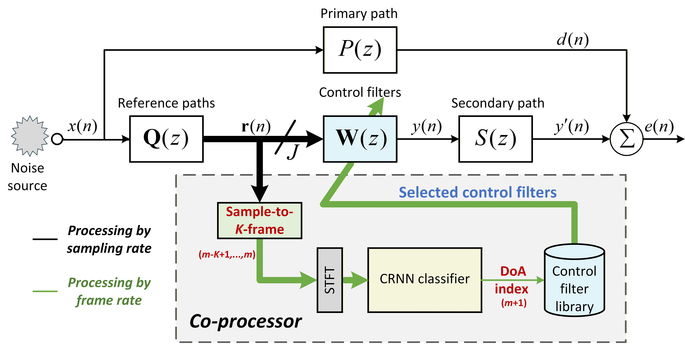
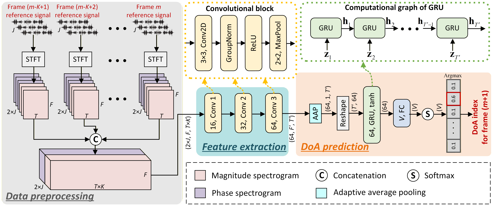

# PD-SFANC

This is the code repository for the paper: **"Predictive Directional Selective Fixed-Filter Active Noise Control for Moving Sources via a Convolutional Recurrent Neural Network"**, published in *Interspeech 2026*.

## Overview

<p align="center">
  
</p>

<p align="center">
  
</p>

## Release Contents

```text
notebooks/07a_end2end_realworld_linear.ipynb
    Runnable PD-SFANC denoising demo with displayed results.

pd_sfanc/
    Core PD-SFANC inference modules.

scripts/run_realworld_linear.py
    Backend used by the notebook.

models/CRNN_interspeech.pth
    Pretrained CRNN azimuth classifier.

data/
    Demo noise, pretrained control filters, and secondary path.
```


## Installation

Create a Python environment and install the required packages:

```bash
pip install -r requirements.txt
```

The demo uses `gpuRIR` for room impulse response simulation. Please install a CUDA-enabled `gpuRIR` build before running the notebook.

## Run the Demo

Open and run:

```text
notebooks/07a_end2end_realworld_linear.ipynb
```

The notebook runs the complete inference-only PD-SFANC pipeline and displays the generated result figure. It also writes the following files to `outputs/`:

```text
realworld_linear_summary.json
realworld_linear_per_frame.csv
realworld_linear_pd_sfanc.png
```

For command-line execution, the same demo can be run with:

```bash
python scripts/run_realworld_linear.py
```


## Citation

If this code is useful for your research, please cite our associated PD-SFANC paper.
